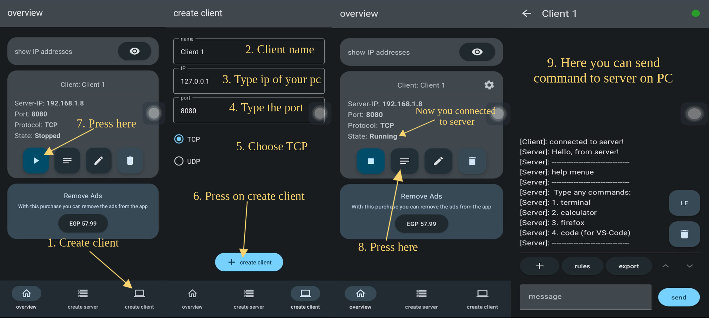

# Linux_PC_Control
This repository includes a basic C++ server application that allows you to send requests from a phone acting as a client to a PC acting as a server to execute specified instructions on the PC server.

## Table of Contents
- demo
- Prerequisites
- Setup Client
- Getting Started
- Usage


## Demo


## Prerequisites

Make sure you meet the following prerequisites before you start:

- C++ compiler (e.g., g++)
- Linux-based operating system (the example is tested on Ubuntu)
- install the app in the phone

## Setup Client

1. Download [Tcp Udp Server & Client](https://play.google.com/store/apps/details?id=tcpudpserverclient.steffenrvs.tcpudpserverclient&pcampaignid=web_share)
2. follow these steps:



## Getting Started

1. Clone this repository to your local machine:

   ```bash
   
   ```

2. Compile the server program:

      ```bash
      g++ main.cpp Server.cpp -o main
      ```


## Usage
1. Start the server:

   ```bash
   ./main
   ```

   The server will start listening on the specified port (default is 5000).

2. Connect to the server using a client application or a terminal.

3. Send one of the predefined commands to the server, such as [ terminal / calendar / firefox / nautilus / sudoku / calculator ].
   


